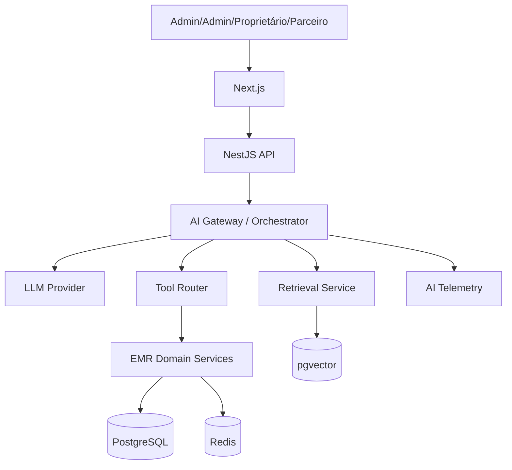

# EMR Despachante — AI Architecture

## Arquitetura



## AI Gateway

Responsável por:
- autenticação contextual;
- role;
- feature;
- prompt version;
- tools disponíveis;
- structured output;
- token budget;
- fallback;
- telemetry.

## Tools

O modelo recebe tools diferentes por perfil.

### ADMIN
- searchCustomers
- getCustomerSummary
- getVehicleStatus
- listCases
- getCaseDetail
- getCaseTimeline
- listServiceRequests
- getPaymentSummary
- getServiceRequest
- getPartnerSummary
- searchInternalKnowledge

### ADMIN
Tudo da ADMIN +
- getAdminDashboardMetrics
- getReconciliationIssues
- getOperatorMetrics

### PROPRIETÁRIO
- getMyVehicles
- getMyVehicleStatus
- getMyFines
- getMyLicensing
- getMyOrder
- getMyPayment
- searchPublicHelp

### PARCEIRO
Escopo futuro/restrito, se houver chat:
- getMyPartnerServiceRequests
- getMyPartnerServiceRequest
- getMyPartnerDocuments
- searchPartnerHelp

Sem acesso a notas internas, dados de outros parceiros ou ferramentas amplas de operação.

## Read tools x Write tools

### Read
Podem executar automaticamente após autorização.

### Write
Exigem confirmação humana.

Exemplos:
- assignCase
- changeCaseStatus
- createRefundRequest
- resendCustomerNotification
- sendCustomerMessage
- sendPartnerMessage

Criar ServiceRequest a partir de WhatsApp inbound com IA é discovery futuro e deve exigir validação humana de placa, serviço, documentos e vínculo.

## RAG

### Fontes
- FAQ;
- runbooks;
- procedimentos;
- políticas;
- catálogo;
- documentação operacional.

### Pipeline

```text
Documento
  ↓
normalização/chunk
  ↓
embedding
  ↓
pgvector

Pergunta
  ↓
hybrid retrieval
  ↓
tenant/role filters
  ↓
top chunks
  ↓
LLM
```

## Regra de autorização

A autorização não fica no prompt.

Cada tool aplica policy server-side.

Mesmo que o modelo solicite:
`getVehicle(vehicleId=outroUsuario)`

a tool deve negar.

Para parceiro, a policy também deve negar qualquer tentativa de organization escape entre PartnerOrganizations.

## Structured Outputs

Resumos operacionais usam schema.

Exemplo:

```json
{
  "summary": "...",
  "currentState": "...",
  "risk": "HIGH",
  "recommendedNextAction": "...",
  "facts": [
    {"type": "PAYMENT_STATUS", "value": "PAID"}
  ]
}
```

## Fallback

Se o LLM cair:
- mostrar “Copilot temporariamente indisponível”;
- preservar navegação normal;
- manter busca global;
- manter regras operacionais.
