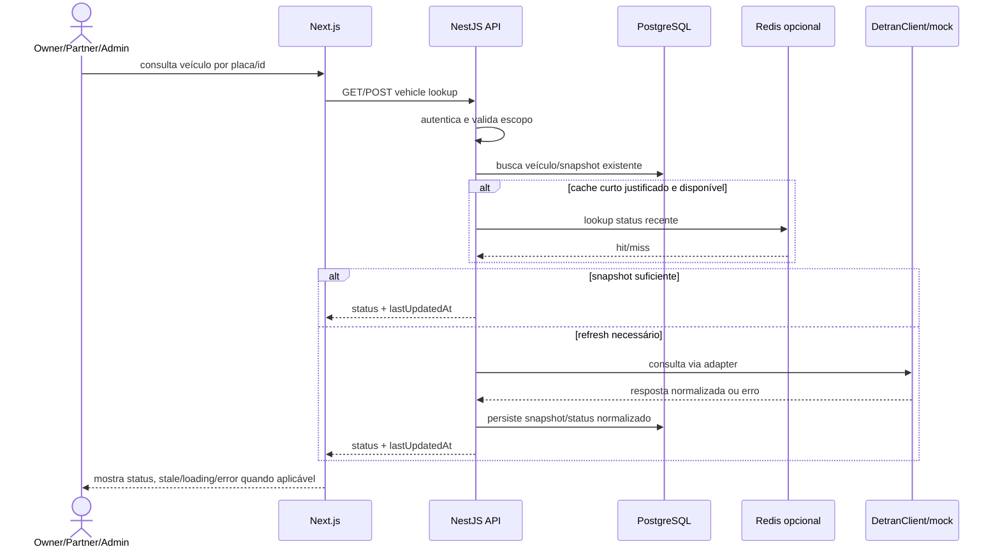
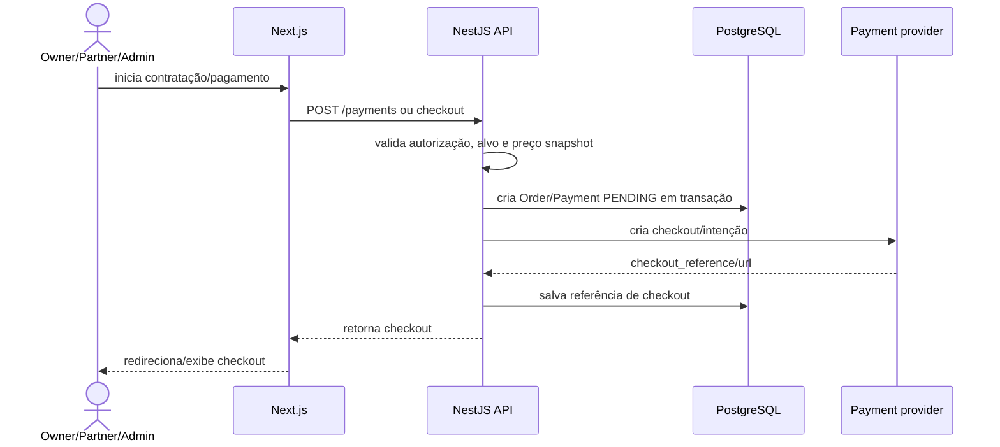
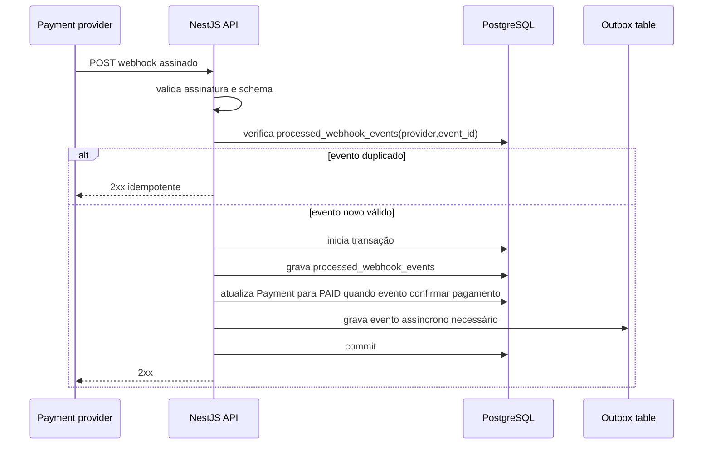
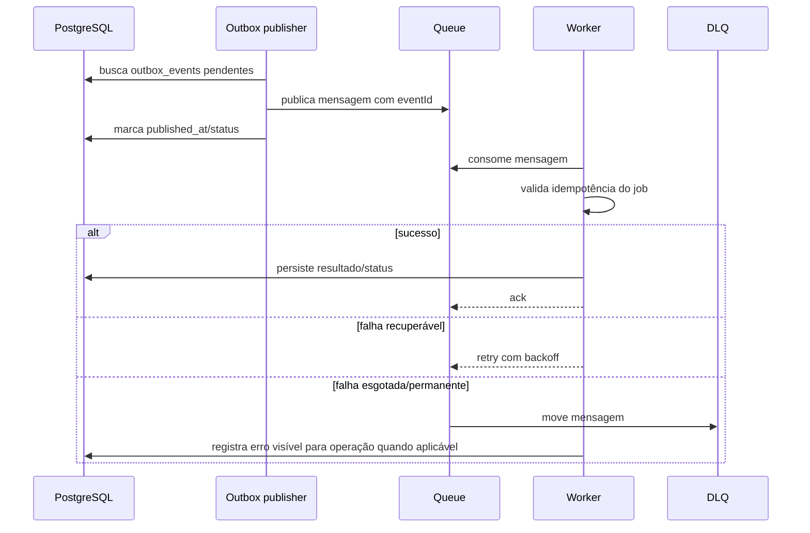
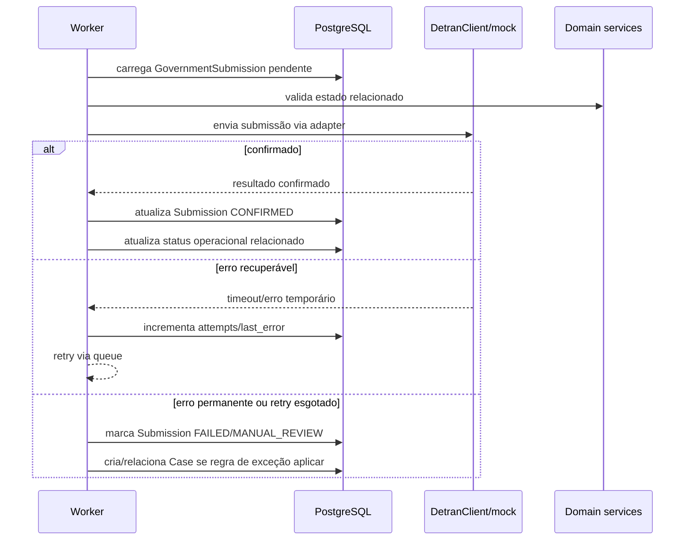
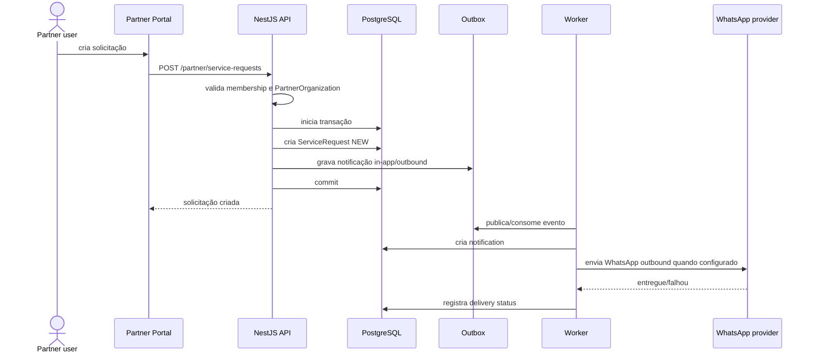
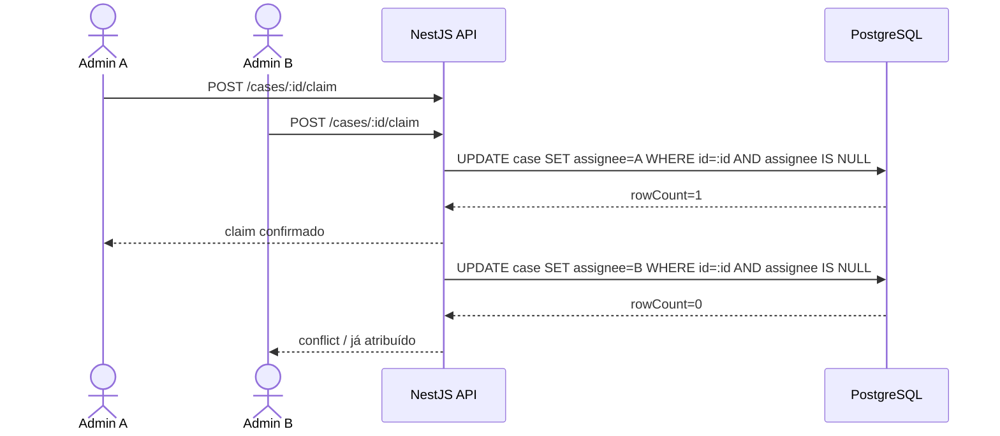
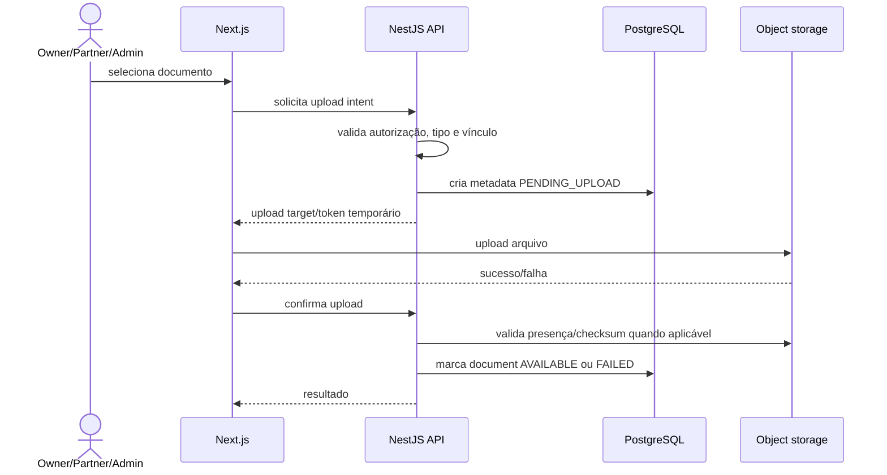

# EMR Despachante — Critical Flows

> Sequence diagrams dos fluxos críticos do System Design.

## 1. Vehicle lookup

Regras:

- PostgreSQL mantém snapshot e estado normalizado.
- Redis, se existir, é cache curto e dispensável.
- Dados stale devem mostrar `lastUpdatedAt`.
- Falha externa não deve apagar último snapshot conhecido.

## 2. Checkout/payment

Regras:

- Checkout iniciado não confirma pagamento.
- Preço usado no Order/Payment vem de snapshot histórico.
- Duplicidade deve ser bloqueada por idempotency key/constraint quando aplicável.

## 3. Webhook de pagamento

Regras:

- Payment só vira `PAID` via evento válido/idempotente do provider.
- Redirect/frontend nunca confirma pagamento.
- Payment `PAID` não conclui ServiceRequest automaticamente.

## 4. Outbox → queue → worker

Regras:

- Outbox nasce na mesma transação do fato de domínio.
- Worker deve ser idempotente.
- DLQ exige visibilidade operacional.

## 5. Government submission

Regras:

- Submission não sobrescreve estado financeiro.
- Erro externo não deve virar loop infinito.
- Case nasce apenas quando houver exceção documentada.

## 6. Partner request + notification

Regras:

- Partner só acessa sua PartnerOrganization.
- WhatsApp não é fonte da verdade.
- Falha de notificação não desfaz ServiceRequest.

## 7. Case claim concorrente

Regras:

- Claim é concorrente-safe por update condicional ou optimistic locking.
- UI pode prevenir duplo clique, mas banco/API garantem a regra.
- Conflito deve retornar estado atual para refresh seguro.

## 8. Documentos

Regras:

- Object storage guarda arquivo; metadata/autorização ficam no banco/API.
- Documentos são privados.
- Download exige autorização server-side antes de URL temporária.
- Upload failure deve deixar estado recuperável.
