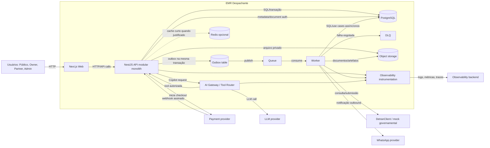

# EMR Despachante — Container Diagram C4 C2

> Diagrama de containers do System Design inicial.

## C2 — Container Diagram

## Containers internos

| Container | Responsabilidade | Comunicação |
| --- | --- | --- |
| Next.js Web | Experiência pública, owner, partner e admin. | HTTP síncrono com API. |
| NestJS API modular monolith | Autorização, validação, domínio, transações, webhooks e endpoints. | HTTP síncrono, SQL, outbox. |
| AI Gateway / Tool Router | Boundary do Copilot, tools autorizadas, guardrails e telemetry. | Chamadas síncronas para LLM e tools. |
| PostgreSQL | Fonte da verdade transacional, outbox, metadata e auditoria. | SQL síncrono. |
| Outbox table | Registro transacional de efeitos assíncronos. | Escrita síncrona na transação; publicação assíncrona. |
| Queue | Transporte de jobs e eventos para worker. | Assíncrono. |
| DLQ | Isolamento de mensagens com falha esgotada. | Assíncrono; requer visibilidade operacional. |
| Worker | Integrações externas, retries, notificações, documentos, reconciliação e jobs. | Consome queue; chama adapters. |
| Object storage | Arquivos privados e artefatos. | Acesso mediado por API/worker. |
| Redis opcional | Cache curto ou rate limit quando medição justificar. | Opcional; indisponibilidade não pode quebrar fonte da verdade. |
| Observability instrumentation | Emissão de logs, métricas e traces. | Envia para backend de observability. |

## Comunicação síncrona

- Usuário acessa Next.js via HTTP.
- Next.js chama NestJS API via HTTP.
- API lê/escreve PostgreSQL em transações.
- API inicia checkout no payment provider quando necessário.
- Payment provider chama webhook da API; API valida assinatura e idempotência.
- Copilot chama AI Gateway; AI Gateway chama LLM provider e tools autorizadas.

## Comunicação assíncrona

- API escreve outbox junto da transação de domínio.
- Publisher/processo equivalente publica outbox na queue.
- Worker consome queue e executa tarefas idempotentes.
- Worker chama DetranClient/mock, providers de notificação e object storage.
- Falha esgotada vai para DLQ e deve ser visível para Admin.
- Scheduler/jobs periódicos publicam trabalho na queue quando aplicável.

## Regras do C2

- NestJS permanece modular monolith; módulos internos não são microservices.
- Worker é executor assíncrono do mesmo domínio, não um domínio independente.
- PostgreSQL é a fonte da verdade.
- Redis, queue, DLQ, object storage, observability e LLM provider não substituem estado transacional.
- Outbox é padrão de confiabilidade, não um serviço de domínio separado.
- Separação futura em serviços só deve acontecer com necessidade demonstrável.
