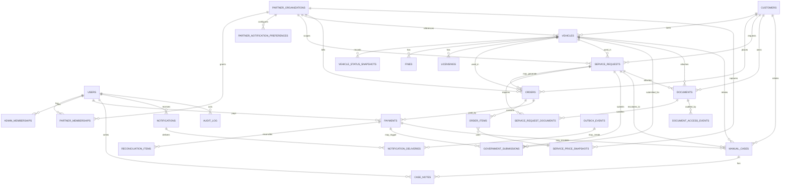

# EMR Despachante — ERD

> ERD conceitual derivado dos boundaries de domínio.

## Diagrama

## Notas de leitura

- `PartnerOrganization` não é `Customer`.
- `ServiceRequest` é trabalho normal; `ManualCase` é exceção.
- `Order` é comercial; `Payment` é financeiro; `GovernmentSubmission` é integração externa.
- `Document` guarda metadata no banco; binário fica em object storage privado.
- `OutboxEvents` representa efeitos assíncronos publicados depois da transação.

## Constraints críticas no ERD

- `Payment` só vira `PAID` por webhook/evento válido e idempotente do provider.
- `Payment PAID` não conclui `ServiceRequest` automaticamente.
- `ServiceRequest` não cria `ManualCase` sem exceção documentada.
- `ServicePriceSnapshot` é imutável após capturado.
- Autorização é server-side e baseada em ownership/organization scope.
- Webhook idempotente exige unique `provider + event_id`.
- Submissões externas exigem idempotency key quando houver retry.
- Audit log, quando aplicável, é append-only.
