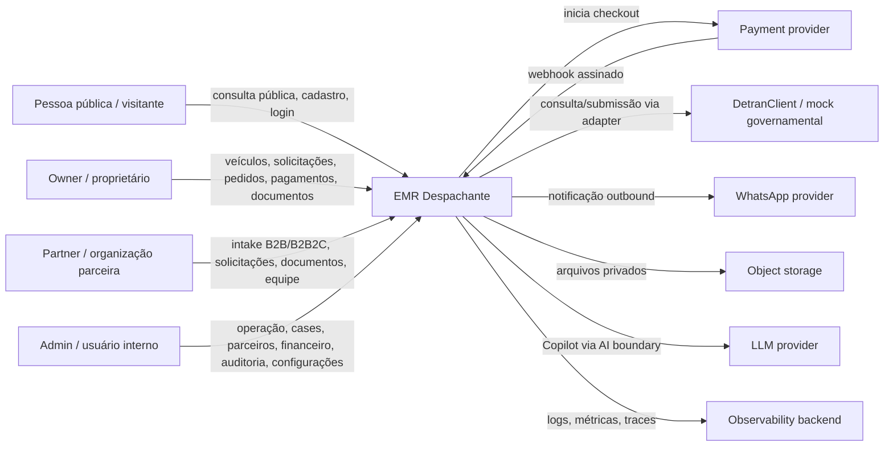

# EMR Despachante — System Context C4 C1

> Diagrama de contexto do sistema: usuários, EMR Despachante e sistemas externos.

## C1 — System Context

## Atores

| Ator | Interação principal |
| --- | --- |
| Pessoa pública / visitante | Consulta inicial, entrada pública, cadastro e login. |
| Owner / proprietário | Gerencia próprios veículos, solicita serviços, acompanha pedidos, pagamentos e documentos. |
| Partner / organização parceira | Cria e acompanha solicitações B2B/B2B2C para sua PartnerOrganization. |
| Admin / usuário interno | Opera solicitações, Cases, clientes, parceiros, financeiro, auditoria e configurações. |

## Sistemas externos

| Sistema externo | Relação com EMR | Fonte da verdade interna? |
| --- | --- | --- |
| Payment provider | Checkout e eventos de pagamento assinados. | Não; o estado interno fica no PostgreSQL após validação. |
| DetranClient / mock governamental | Consulta e submissão de serviços veiculares. | Não; informa resultado externo normalizado. |
| WhatsApp provider | Canal outbound de notificação. | Não; notificação não cria nem muda fato de domínio. |
| Object storage | Armazena arquivos privados. | Parcial para o binário; metadata/autorização ficam no EMR. |
| LLM provider | Geração de respostas do EMR Copilot. | Não; IA não substitui domínio nem banco. |
| Observability backend | Recebe logs, métricas e traces. | Não; não decide estado de negócio. |

## Regras de contexto

- O EMR é o boundary de domínio e autorização.
- O payment provider confirma eventos externos, mas não altera estado interno sem validação da API.
- A integração governamental pode falhar ou atrasar; fluxos devem tolerar processamento assíncrono.
- WhatsApp é canal, não sistema de registro.
- AI boundary impede acesso direto do LLM ao banco.
- Não há microservices definidos no C1.
