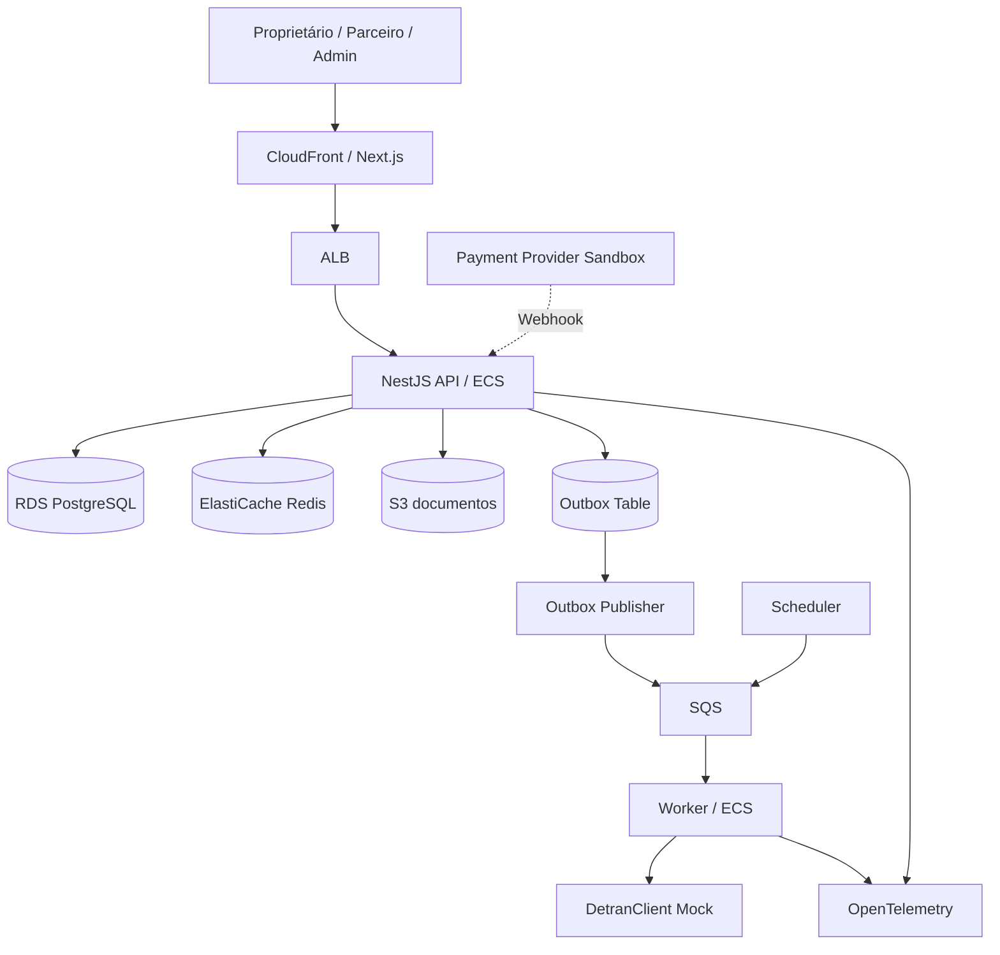
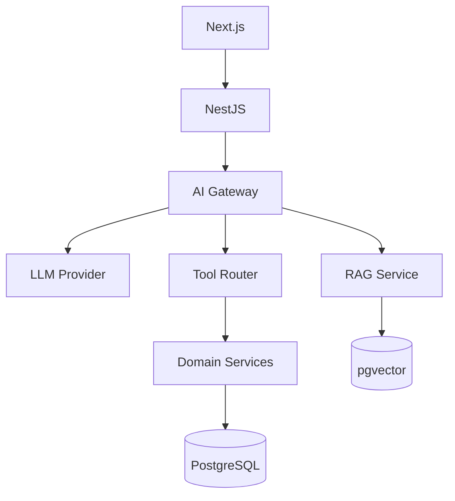

# EMR Despachante — Architecture

## Arquitetura alvo



## Fluxo 0 — Partner Portal intake

```text
Parceiro cria solicitação
        ↓
API valida PartnerOrganization, membership e veículo
        ↓
ServiceRequest = NEW
        ↓
Notificação in-app
        +
WhatsApp outbound quando configurado
        ↓
Operação trabalha solicitação
        ↓
Case somente se houver exceção
```

WhatsApp não é fonte da verdade e falha de notificação não bloqueia a criação da ServiceRequest.

## Fluxo 1 — Consulta

```text
Dashboard / Vehicle detail
        ↓
API
        ↓
Redis
   ├── HIT → resposta + lastUpdatedAt
   └── MISS
        ↓
DetranClient
        ↓
Postgres snapshot
        ↓
Redis
```

## Fluxo 2 — Pagamento

```text
Usuário inicia
    ↓
API cria PENDING
    ↓
Provider checkout
    ↓
Usuário paga
    ↓
Webhook assinado
    ↓
API valida
    ↓
Payment = PAID
Outbox = SUBMIT_FINE_CLEARANCE
    ↓
SQS
    ↓
Worker
    ↓
DetranClient
```

## Fluxo 3 — Checagem periódica

```text
Scheduler
    ↓
job por batch
    ↓
SQS
    ↓
Workers
    ↓
DetranClient
    ↓
Snapshot diff
    ↓
Eventos de mudança
```

## Fluxo 4 — Dashboard

Evitar montar dashboard com múltiplas chamadas desnecessárias.

```text
GET /dispatcher/dashboard
        ↓
DashboardQueryService
        ↓
Queries agregadas/read model
        ↓
Redis curto opcional
```

## Componentes

### API
- auth;
- clients;
- vehicles;
- fines;
- licensing;
- payments;
- dashboard;
- service requests;
- partners;
- cases;
- documents;
- audit.

### Worker
- periodic vehicle check;
- government submission;
- document generation;
- notification;
- reconciliation jobs.

### Scheduler
Dispara checagem periódica sem processar lógica pesada.

### DetranClient
Interface:

```ts
interface DetranClient {
  getVehicleStatus(input): Promise<VehicleGovernmentStatus>
  submitFineClearance(input): Promise<SubmissionResult>
  submitLicensing(input): Promise<SubmissionResult>
}
```

Implementação mock:
- latência variável;
- falha aleatória;
- timeouts;
- respostas inconsistentes controladas para testes.

## Estratégia de dashboard

### V1
Agregações SQL + índices.

### V2
Cache curto por despachante.

### V3
Read model dedicado se o volume justificar.

Não começar com CQRS pesado sem necessidade.

## Consistência

### Forte
- pagamento ativo único;
- webhook processado único;
- transições financeiras;
- vínculo despachante-cliente;
- membership de parceiro;
- isolamento de PartnerOrganization;
- ServiceRequestSource persistido;
- isolamento de carteira.

### Eventual
- status reconhecido pelo Detran mock;
- dashboard agregado;
- notificações;
- WhatsApp outbound;
- atualização periódica.

## ServiceRequest vs Case

```text
ServiceRequest = trabalho normal solicitado por proprietário, parceiro ou operação.
Case = exceção/problema que exige intervenção humana especial.
```

Não reutilizar CaseStatus para ServiceRequest.
Não decidir aqui se PartnerOrganization é Tenant; essa pergunta pertence ao System Design.

## Status model

### VehicleOverallStatus
- REGULAR
- ATTENTION
- IRREGULAR
- PROCESSING
- MANUAL_REVIEW
- UNKNOWN

### PaymentStatus
- PENDING
- PAID
- FAILED
- REFUNDED
- CANCELLED

### GovernmentSubmissionStatus
- NOT_REQUESTED
- QUEUED
- PROCESSING
- CONFIRMED
- FAILED
- MANUAL_REVIEW

## Fallback

DetranClient fora:
- usar snapshot anterior;
- mostrar timestamp;
- enfileirar retry quando apropriado;
- criar case manual após threshold.

Payment provider fora:
- não fingir sucesso;
- checkout indisponível/processando;
- webhook posterior continua sendo verdade.

Redis fora:
- Postgres continua fonte de verdade.

S3 fora:
- operações sem documento continuam;
- geração/download pode ficar PROCESSING/FAILED.

## ADRs sugeridos
- ADR-001 duplicate payment prevention
- ADR-002 webhook idempotency
- ADR-003 transactional outbox
- ADR-004 DetranClient adapter
- ADR-005 dashboard read model strategy
- ADR-006 dispatcher-client consent
- ADR-007 financial state machine
- ADR-008 manual case creation policy
- ADR-009 cache and staleness policy
- ADR-010 document storage and access


---

# Camada de IA



## Regra crítica
LLM não recebe credencial de banco e não executa SQL arbitrário.

## Autorização
Tools usam o mesmo authorization context da API normal.

## Consistência
IA não participa da garantia de consistência financeira.
As invariantes continuam no domínio/banco.
